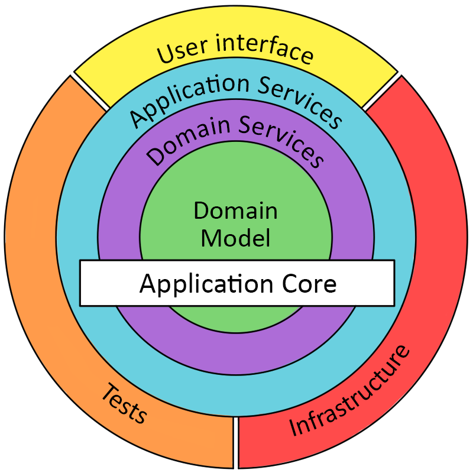

# Onion Architecture Explanation

**Onion Architecture, introduced by Jeffrey Palermo, is a domain-centric approach designed to overcome the coupling issues of traditional layered architectures. It emphasizes placing the core business logic at the center, isolated from external concerns like databases, frameworks, and user interfaces. It is closely related to Hexagonal Architecture and Clean Architecture, all of which prioritize the separation of business rules from infrastructure details through the Dependency Inversion Principle (DIP).**

*Dependency Inversion Principle (DIP)*
1. High-level modules should not depend on low-level modules. Both should depend on abstractions.
2. Abstractions should not depend on details. Details should depend on abstractions.



* **Domain Layer** (Core): 
    *Contains business entities and repository interfaces. No dependencies on other layers.*
    * Content: Entities (core business objects), Value Objects, and core Domain Services (business rules)
    * Key Principle: Contains no dependencies on any external framework, database, or UI. It is the purest expression of the business.

* **Application Layer / Domain Services**: 
    *Contains use cases and business logic orchestration. Depends only on Domain layer.*
    * Content: Use Cases (also called Interactors or Application Services). These orchestrate the flow of data to/from the Domain Entities to fulfill a specific application feature.
    * Key Principle: This layer defines the interfaces for external components (like Repository Interfaces for persistence, or Email Service Interfaces for communication) that the inner Domain logic needs.

* **Infrastructure Layer**: 
    *Contains concrete implementations (Django ORM). Depends on Domain layer.*
    * Content: Concrete implementations of all the interfaces defined in the inner layers.
    * Examples: Database Repositories (e.g., a SQLUserRepository implementing the IUserRepository interface), ORM setup, external API clients, logging implementation.

* **Presentation Layer**: 
    *Contains API views and serializers (DRF). Depends on Application and Infrastructure layers.*
    * Content: Entry points into the application.
    * Examples: Web Controllers (like Django Views/DRF ViewSets), Desktop UI code, Test runners, and Dependency Injection configuration (the glue that wires interfaces to implementations).


The dependency rule: inner layers don't know about outer layers. This makes the code testable, maintainable, and framework-independent.

### Pros and Cons

| Feature        | Pros (Why to Use)                                                                 | Cons (When to be Careful)                                                                 |
|----------------|------------------------------------------------------------------------------------|-------------------------------------------------------------------------------------------|
| Testability    | Extremely High — Core business logic can be unit-tested without needing a database, web server, or UI. Infrastructure components are easily mocked. | Initial Complexity/Overhead — Requires significant setup, interfaces, and boilerplate code, especially for simple CRUD applications. |
| Maintainability | Changes in the outer layer (e.g., swapping databases from PostgreSQL to MongoDB) do not affect the core business logic. | Learning Curve — Developers must strictly adhere to the inward dependency rule, which is a conceptual shift from traditional layered architectures. |
| Flexibility    | Framework/Database Independent — Core is shielded from technology decisions, allowing easy swapping of the database, ORM, or even the web framework. | Increased Code Verbosity — Heavy use of abstractions and interfaces can lead to more files and layers for simple logic. |
| Domain Focus   | Enforces strong focus on Domain Model and business rules; aligns well with DDD principles. | Performance (Minor) — Additional abstraction layers (interfaces, mappers) may introduce slight runtime overhead. |

### When to Use Onion Architecture
*We should choose the Onion Architecture for projects that are:*

* **Domain-Heavy**: The core complexity lies in the business logic (e.g., financial systems, complicated inventory management, healthcare platforms).

* **Long-Lived and Evolving**: Applications expected to have a long life span where infrastructure will likely change over time (e.g., migrating from one cloud provider or database to another).

* **Highly Testable**: Projects where unit testing the core business logic in complete isolation is a critical requirement.

When NOT to Use: For small, simple applications or MVPs that primarily perform basic CRUD (Create, Read, Update, Delete) operations with minimal, straightforward business rules, the complexity added by the Onion pattern is usually not justified.


## Project setup
```bash
git clone https://github.com/sudiptoshahin/project-structures.git
cd project-structures
cd 2web-onion-django

python3 -m venv env
source venv/bin/activate
```


### Backend setup
```bash
cd backend

pip install -r requirements.txt
python manage.py makemigrations
python manage.py makemigrations users
python manage.py migrate
python manage.py runserver
```

### Frontend
```bash
cd frontend
npm i
npm run dev
```

### Access the Application
- Frontend: http://localhost:3000
- Backend API: http://localhost:8000/api/users/
- Admin Panel: http://localhost:8000/admin